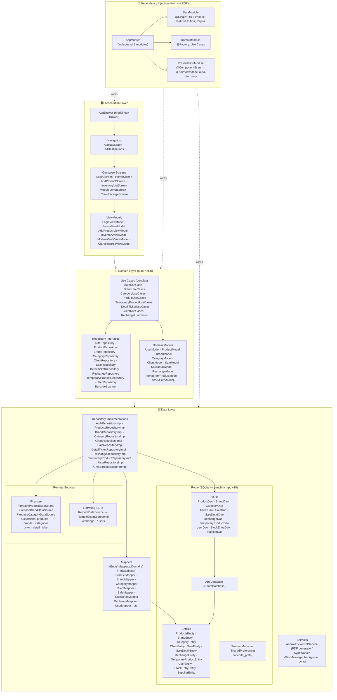
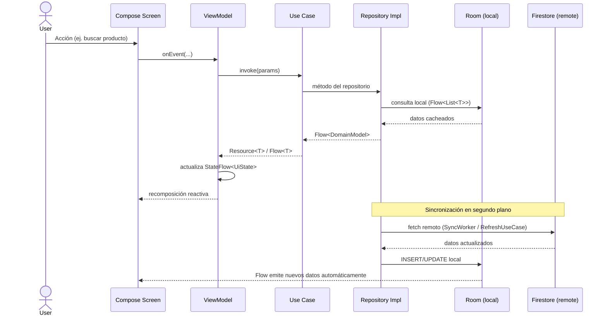

# PanchitaApp — Diagramas de Arquitectura

## Diagrama de Capas

```mermaid
graph TD
    subgraph PRESENTATION["🖥️ Presentation Layer"]
        direction TB
        NAV["Navigation\nAppNavGraph · AllDestinations"]
        VM["ViewModels\nLoginViewModel · HomeViewModel\nAddProductViewModel · InventoryViewModel\nModuloVentaViewModel · ClaroRecargaViewModel"]
        UI["Compose Screens\nLoginScreen · HomeScreen\nAddProductScreen · InventoryListScreen\nModuloVentaScreen · ClaroRecargaScreen"]
        DRAWER["AppDrawer (Modal Nav Drawer)"]
        UI --> VM
        NAV --> UI
        DRAWER --> NAV
    end

    subgraph DOMAIN["🧩 Domain Layer (pure Kotlin)"]
        direction TB
        UC["Use Cases (bundles)\nAuthUseCase · BrandUseCases\nCategoryUseCases · ProductUseCases\nTemporaryProductUseCases · DetailTicketUseCases\nClientUseCases · RechangeUseCases"]
        REPO_I["Repository Interfaces\nAuthRepository · ProductRepository\nBrandRepository · CategoryRepository\nClientRepository · SaleRepository\nDetailTicketRepository · RechangeRepository\nTemporaryProductRepository · UserRepository\nBarcodeScanner"]
        MODEL["Domain Models\nUserModel · ProductModel · BrandModel\nCategoryModel · ClientModel · SaleModel\nSaleDetailModel · RechangeModel\nTemporaryProductModel · StockEntryModel"]
        UC --> REPO_I
        UC --> MODEL
    end

    subgraph DATA["🗄️ Data Layer"]
        direction TB
        REPO_IMPL["Repository Implementations\nAuthRepositoryImpl · ProductsRepositoryImpl\nBrandRepositoryImpl · CategoryRepositoryImpl\nClientRepositoryImpl · SaleRepositoryImpl\nDetailTicketRepositoryImpl · RechangeRepositoryImpl\nTemporaryProductRepositoryImpl · UserRepositoryImpl\nGmsBarcodeScannerImpl"]

        subgraph LOCAL["Room (SQLite — panchita_app v18)"]
            ENTITIES["Entities\nProductsEntity · BrandEntity · CategoryEntity\nClientEntity · SaleEntity · SaleDetailEntity\nRechangeEntity · TemporaryProductEntity\nUserEntity · StockEntryEntity · SupplierEntity"]
            DAOS["DAOs\nProductDao · BrandDao · CategoryDao\nClientDao · SaleDao · SaleDetailDao\nRechangeDao · TemporaryProductDao\nUserDao · StockEntryDao · SupplierDao"]
            DB["AppDatabase (RoomDatabase)"]
            SESS["SessionManager (SharedPreferences\npanchita_prefs)"]
        end

        subgraph REMOTE["Remote Sources"]
            FIREBASE["Firestore\nFirebaseProductDataSource\nFirebaseBrandDataSource\nFirebaseCategoryDataSource\nCollections: products · brands · categories\nticket · detail_ticket"]
            RETROFIT["Retrofit (REST)\nRemoteDataSource → RemoteDataSourceImpl\n/rechange · /users"]
        end

        MAPPERS["Mappers\n{Entity}Mapper.toDomain() / .toDatabase()\nProductMapper · BrandMapper · CategoryMapper\nClientMapper · SaleMapper · SaleDetailMapper\nRechangeMapper · UserMapper · etc."]

        SERVICES["Services\nAndroidTicketPdfService (PDF generation)\nSyncWorker (WorkManager background sync)"]

        REPO_IMPL --> DAOS
        REPO_IMPL --> FIREBASE
        REPO_IMPL --> RETROFIT
        REPO_IMPL --> MAPPERS
        MAPPERS --> ENTITIES
        DAOS --> DB
        DB --> ENTITIES
    end

    subgraph DI["💉 Dependency Injection (Koin 4 + KSP)"]
        APPMOD["AppModule\n(includes all 3 modules)"]
        DATAMOD["DataModule\n@Single: DB, Firebase, Retrofit, DAOs, Repos"]
        DOMAINMOD["DomainModule\n@Factory: Use Cases"]
        PRESMOD["PresentationModule\n@ComponentScan → @KoinViewModel auto-discovery"]
        APPMOD --> DATAMOD
        APPMOD --> DOMAINMOD
        APPMOD --> PRESMOD
    end

    PRESENTATION --> DOMAIN
    DOMAIN --> DATA
    DI -.->|"wires"| PRESENTATION
    DI -.->|"wires"| DOMAIN
    DI -.->|"wires"| DATA
```

---

## Flujo de Datos (Offline-First)

```mermaid
sequenceDiagram
    actor User
    participant Screen as Compose Screen
    participant VM as ViewModel
    participant UC as Use Case
    participant Repo as Repository Impl
    participant Room as Room (local)
    participant Firebase as Firestore (remote)

    User->>Screen: Acción (ej. buscar producto)
    Screen->>VM: onEvent(...)
    VM->>UC: invoke(params)
    UC->>Repo: método del repositorio
    Repo->>Room: consulta local (Flow<List<T>>)
    Room-->>Repo: datos cacheados
    Repo-->>UC: Flow<DomainModel>
    UC-->>VM: Resource<T> / Flow<T>
    VM->>VM: actualiza StateFlow<UiState>
    VM-->>Screen: recomposición reactiva
    
    Note over Repo,Firebase: Sincronización en segundo plano
    Repo->>Firebase: fetch remoto (SyncWorker / RefreshUseCase)
    Firebase-->>Repo: datos actualizados
    Repo->>Room: INSERT/UPDATE local
    Room-->>Screen: Flow emite nuevos datos automáticamente
```
